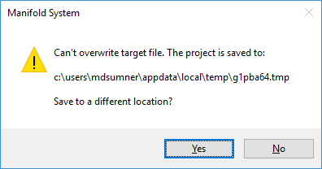
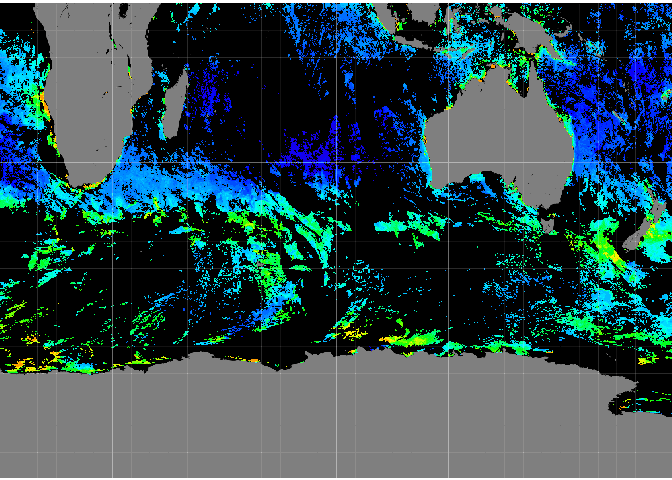

<!-- README.md is generated from README.Rmd. Please edit that file -->
manifoldr
=========

Manifoldr allows direct connection to Manifold .map projects from R via ODBC. We can read tables in full, or issue SQL queries to select or dynamically created new tables.

Installation
------------

1.  `manifoldr` relies on [Manifold® System](http://www.manifold.net) GIS, it's of no use if you don't have this installed and working.

2.  `manifoldr` is only available from GitHub: the easiest way to install it is to use the `devtools` package.

``` r
if (packageVersion("devtools") < 1.6) {
  install.packages("devtools")
}
devtools::install_github("mdsumner/manifoldr")
```

(Future versions may become available on CRAN. )

NOTE:
-----

-   The ODBC driver for Manifold is *read-only*, so we cannot modify the contents of an existing file.

Please take care not to modify a Manifold project while an R session has a open connection to it. If you try to save such a project, you will get an error like this:



If you see this, and you want to save your changes you must choose "Yes", and save the file to a new location. There is no other option that I know of.

Basic Usage
-----------

Read in a drawing.

``` r
library(manifoldr)
library(RODBC)
mapfile <- system.file("extdata", "AreaDrawing.map", package = "manifoldr")

geom2D <- DrawingA(mapfile, "Drawing")
geom2D
#> class       : SpatialPolygonsDataFrame 
#> features    : 6 
#> extent      : -178, 924.5, -52, 202  (xmin, xmax, ymin, ymax)
#> coord. ref. : +proj=laea +lat_0=0 +lon_0=0 +x_0=0 +y_0=0 +datum=WGS84 +units=m +no_defs +ellps=WGS84 +towgs84=0,0,0 
#> variables   : 2
#> names       : ID, Name 
#> min values  : 10,    E 
#> max values  : 15,    O

geom1D <- DrawingL(mapfile, "Drawing")
geom1D
#> class       : SpatialLinesDataFrame 
#> features    : 2 
#> extent      : -615.2802, 1334.871, -565.2889, 612.3995  (xmin, xmax, ymin, ymax)
#> coord. ref. : +proj=laea +lat_0=0 +lon_0=0 +x_0=0 +y_0=0 +datum=WGS84 +units=m +no_defs +ellps=WGS84 +towgs84=0,0,0 
#> variables   : 2
#> names       : ID, Name 
#> min values  : 22,  Inf 
#> max values  : 24, -Inf

geom0D <- DrawingP(mapfile, "Drawing")
geom0D
#> class       : SpatialPointsDataFrame 
#> features    : 23 
#> extent      : -615.2802, 1091.102, -565.2889, 473.103  (xmin, xmax, ymin, ymax)
#> coord. ref. : +proj=laea +lat_0=0 +lon_0=0 +x_0=0 +y_0=0 +datum=WGS84 +units=m +no_defs +ellps=WGS84 +towgs84=0,0,0 
#> variables   : 2
#> names       : ID, Name 
#> min values  : 26,      
#> max values  : 48,    O
```

Unfortunately this must be done separately for points lines or areas, for now. Future versions will levarage `gris` or something like it to read a Drawing in its full state.

Read in a surface.

``` r
library(raster)
#> Loading required package: sp
mapfile2 <- system.file("extdata", "Montara_20m.map", package= "manifoldr")

gg <- Surface(mapfile2, "Montara")

gg
#> class       : RasterLayer 
#> dimensions  : 698, 558, 389484  (nrow, ncol, ncell)
#> resolution  : 20, 19.98565  (x, y)
#> extent      : 544122.5, 555282.5, 4151917, 4165867  (xmin, xmax, ymin, ymax)
#> coord. ref. : +proj=tmerc +lat_0=0 +lon_0=-123 +k=1 +x_0=500000 +y_0=0 +datum=NAD27 +to_meter=20 +no_defs +ellps=clrk66 +nadgrids=@conus,@alaska,@ntv2_0.gsb,@ntv1_can.dat 
#> data source : in memory
#> names       : layer 
#> values      : -1, 1931  (min, max)
```

Read in an image.

``` r
mapfile3 <- system.file("extdata", "V20160202016022.L3m_R3QL_NPP_CHL_chlor_a_9km.map", package= "manifoldr")
im <- Image(mapfile3, "V20160202016022.L3m_R3QL_NPP_CHL_chlor_a_9km")
plotRGB(im)
```



``` r
im
#> class       : RasterBrick 
#> dimensions  : 1081, 2159, 2333879, 3  (nrow, ncol, ncell, nlayers)
#> resolution  : 0.08333333, 0.08333333  (x, y)
#> extent      : 0.08332613, 180, -90, 0.08332973  (xmin, xmax, ymin, ymax)
#> coord. ref. : +proj=longlat +datum=WGS84 +no_defs +ellps=WGS84 +towgs84=0,0,0 
#> data source : in memory
#> names       : layer.1, layer.2, layer.3 
#> min values  :       0,       0,       0 
#> max values  :     255,     255,     255
```

Build a custom object with SQL
------------------------------

``` r
mapfile <- system.file("extdata", "AreaDrawing.map", package = "manifoldr")

x <- manifoldr:::readmfd(mapfile, "Drawing",  query = "SELECT [Name], [Branches (I)], [X (I)] FROM [Drawing] WHERE isArea([ID]) ORDER BY [NAME]", spatial = FALSE)
```

Lower level usage
-----------------

Open a connection to a built-in .map file and issue a query.

``` r
library(manifoldr)
library(RODBC)
mapfile <- system.file("extdata", "AreaDrawing.map", package = "manifoldr")
con <- odbcConnectManifold(mapfile)
tab <- sqlQuery(con, "SELECT [ID], [Name], BranchCount([ID]) AS [nBranch] FROM [Drawing] ORDER BY [nBranch]")
close(con)

print(tab)
#>    ID Name nBranch
#> 1  10    L       1
#> 2  11    E       1
#> 3  12    G       1
#> 4  13    I       1
#> 5  15    N       1
#> 6  22            1
#> 7  24            1
#> 8  26    O       1
#> 9  27            1
#> 10 28            1
#> 11 29            1
#> 12 30            1
#> 13 31            1
#> 14 32            1
#> 15 33            1
#> 16 34            1
#> 17 35            1
#> 18 36            1
#> 19 37            1
#> 20 38            1
#> 21 39            1
#> 22 40            1
#> 23 41            1
#> 24 42            1
#> 25 43            1
#> 26 44            1
#> 27 45            1
#> 28 46            1
#> 29 47            1
#> 30 48            1
#> 31 14    O       2
```

All the [standard Manifold SQL](http://www.georeference.org/doc/manifold.htm#sql_in_manifold_system.htm) is available.

NOTE: this will be merged with mdsumnner/dplrodbc in some way. Was originally called RforManifold.

Manifold GIS and R make for a powerful partnership, but the coupling between them has been relatively loose and sketchy.

Two key recent R packages make the coupling more compelling:

-   [wkb](http://cran.rstudio.com/web/packages/wkb/index.html): Convert Between Spatial Objects and Well-Known Binary (WKB) Geometry
-   [rClr](https://rclr.codeplex.com)

The main ways we connect R and Manifold are

1.  read drawing layers with data from Manifold .map files via SQL queries
2.  drive the Manifold API directly via .Net.
3.  (developing) simplify the queries via dplyr

The first provides a pretty tight mapping of high-level data types, i.e. in Manifold we have a drawing and in R we have a Spatial layer and moving from one to the other is easy.

The second provides a lot more power but we need to do more work to transfer data between the systems.

There are lots of other pathways, including GDAL as a third/fourth party and via file transfer.

Examples
--------

### Manifold geometry via RODBC

NOTE: there's no real need for this now, please use higher level functions which do all of this in one step.

We can read from Manifold map files using a bit of SQL and the wkb R package.

``` r
## extensions we need
library(wkb)    ## for parsing WKB blobs as Spatial R objects
library(sp)     ## Spatial R objects
library(RODBC)  ## ODBC in R
library(raster) ## just for nice print methods for sp objects
library(manifoldr)
## open a connection to a map file
## original  file has Local Scale 0.0001, so I use a modified copy "Provinces_"
con <- odbcConnectManifold("E:\\ManifoldDVD\\Data\\World\\Medium Resolution\\World Provinces.map")
## list the available tables if needed
##sqlTables(con)

## read in just the ID and the Geom (I) as WKB 
## (Manifold's Geom includes the CRS so we cast to OGC using CGeomWKB)
## remember this is just a data.frame
ProvincesGeom <- sqlQuery(con, "SELECT [ID], [Country], [Province], CGeomWKB(Geom(ID)) AS [geom] FROM [Provinces_] WHERE [Longitude (I)] > 100 AND [Latitude (I)] < 0")
## get the CRS (somehow)
## . . .
close(con)

## construct an R spatial object from the raw geometry
## this is just SpatialPolygons/Lines/Points (what happens to mixed geom layers?)
Rsp <- readWKB(ProvincesGeom$geom)

## reconstruct our original layer
Countries <- SpatialPolygonsDataFrame(Rsp, subset(ProvincesGeom, select = c("ID", "Country", "Province")))
Countries

plot(Countries)
devtools::session_info()
```

\`\`

Problems
--------

-   Large Geoms and other binary types are stored as the `ODBC_binary` type from the `RODBC` package. Be careful with these columns as they do not have compact printing methods. This is something to added to a future version of this package.

TODO
----

-   illustrate this example in both R and Manifold

<https://github.com/mdsumner/talks/blob/master/SQL_3/SQL_3.rmd>

-   dig up the RODBC reader <https://github.com/mdsumner/mdsutils/blob/master/R/odbcReadManifold.R>

-   get rClr working with Manifold: install from here <https://github.com/jmp75/rClr>

-   parallel CGAL triangulation code with Manifold's DecomposeToTrianglesAdv

-   <https://github.com/mdsumner/dplyrodbc>
