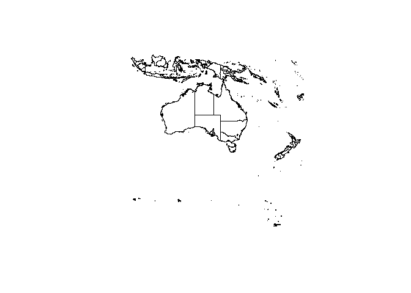

<!-- README.md is generated from README.Rmd. Please edit that file -->
R for Manifold Lifers
==============

NOTE: this will be merged with mdsumnner/dplrodbc in some way. Was originally called RforManifold.

Manifold GIS and R make for a powerful partnership, but the coupling between them has been relatively loose and sketchy.

Two key recent R packages make the coupling more compelling:

-   [wkb](http://cran.rstudio.com/web/packages/wkb/index.html): Convert Between Spatial Objects and Well-Known Binary (WKB) Geometry
-   [rClr](https://rclr.codeplex.com)

The main ways we connect R and Manifold are 1) read drawing layers with data from Manifold .map files via SQL queries 2) drive the Manifold API directly via .Net.

The first provides a pretty tight mapping of high-level data types, i.e. in Manifold we have a drawing and in R we have a Spatial layer and moving from one to the other is easy.

The second provides a lot more power but we need to do more work to transfer data between the systems.

There are lots of other pathways, including GDAL as a third/fourth party and via file transfer.

Examples
--------

-   illustrate this example in both R and Manifold

<https://github.com/mdsumner/talks/blob/master/SQL_3/SQL_3.rmd>

-   dig up the RODBC reader <https://github.com/mdsumner/mdsutils/blob/master/R/odbcReadManifold.R>

-   get rClr working with Manifold: install from here <https://github.com/jmp75/rClr>

-   parallel CGAL triangulation code with Manifold's DecomposeToTrianglesAdv

### Manifold geometry via RODBC

We can read from Manifold map files using a bit of SQL and the wkb R package.

``` r
## extensions we need
library(wkb)    ## for parsing WKB blobs as Spatial R objects
#> Note: no visible binding for global variable '.Data' 
#> Note: no visible binding for global variable '.Data' 
#> Note: no visible binding for global variable '.Data' 
#> Note: no visible binding for global variable '.Data' 
#> Note: no visible binding for global variable '.Data' 
#> Note: no visible binding for global variable '.Data' 
#> Note: no visible binding for global variable '.Data'
library(sp)     ## Spatial R objects
library(RODBC)  ## ODBC in R
library(raster) ## just for nice print methods for sp objects
#> Note: no visible binding for global variable 'plotOrder' 
#> Note: no visible binding for global variable 'coords' 
#> Note: no visible binding for global variable 'coords.nrs' 
#> Note: no visible binding for global variable 'coords' 
#> Note: no visible binding for global variable 'plotOrder' 
#> Note: no visible binding for global variable 'plotOrder' 
#> Note: no visible binding for global variable 'coords'
library(manifoldr)
## open a connection to a map file
## original  file has Local Scale 0.0001, so I use a modified copy "Provinces_"
con <- odbcConnectManifold("E:\\ManifoldDVD\\Data\\World\\Medium Resolution\\World Provinces.map")
## list the available tables if needed
##sqlTables(con)

## read in just the ID and the Geom (I) as WKB 
## (Manifold's Geom includes the CRS so we cast to OGC using CGeomWKB)
## remember this is just a data.frame
ProvincesGeom <- sqlQuery(con, "SELECT [ID], [Country], [Province], CGeomWKB(Geom(ID)) AS [geom] FROM [Provinces_] WHERE [Longitude (I)] > 100 AND [Latitude (I)] < 0")
## get the CRS (somehow)
## . . .
close(con)

## construct an R spatial object from the raw geometry
## this is just SpatialPolygons/Lines/Points (what happens to mixed geom layers?)
Rsp <- readWKB(ProvincesGeom$geom)
#> Note: no visible binding for global variable '.Data'

## reconstruct our original layer
Countries <- SpatialPolygonsDataFrame(Rsp, subset(ProvincesGeom, select = c("ID", "Country", "Province")))
#> Note: no visible binding for global variable 'plotOrder'
Countries
#> class       : SpatialPolygonsDataFrame 
#> features    : 3453 
#> extent      : 99.1389, 180, -78.3533, 2.0833  (xmin, xmax, ymin, ymax)
#> coord. ref. : NA 
#> variables   : 3
#> names       :     ID, Country,                Province 
#> min values  : 359690,        ,              Antarctica 
#> max values  : 392515,  Tuvalu, Yogyakarta [Jogjakarta]

plot(Countries)
```



``` r
devtools::session_info()
#>  setting  value                                      
#>  version  R version 3.2.0 Patched (2015-04-19 r68206)
#>  system   x86_64, mingw32                            
#>  ui       RTerm                                      
#>  language (EN)                                       
#>  collate  English_Australia.1252                     
#>  tz       Australia/Hobart                           
#> 
#>  package      * version    date       source        
#>  curl           0.8        2015-06-06 CRAN (R 3.2.0)
#>  devtools       1.8.0      2015-05-09 CRAN (R 3.2.0)
#>  digest         0.6.8      2014-12-31 CRAN (R 3.2.0)
#>  evaluate       0.7        2015-04-21 CRAN (R 3.2.0)
#>  formatR        1.2        2015-04-21 CRAN (R 3.2.0)
#>  git2r          0.10.1     2015-05-07 CRAN (R 3.2.0)
#>  htmltools      0.2.6      2014-09-08 CRAN (R 3.2.0)
#>  knitr          1.10.5     2015-05-06 CRAN (R 3.2.0)
#>  lattice        0.20-31    2015-03-30 CRAN (R 3.2.0)
#>  magrittr       1.5        2014-11-22 CRAN (R 3.2.0)
#>  memoise        0.2.1      2014-04-22 CRAN (R 3.2.0)
#>  raster       * 2.3-40     2015-04-11 CRAN (R 3.2.0)
#>  Rcpp           0.11.6     2015-05-01 CRAN (R 3.2.0)
#>  RforManifold * 0.0.0.9000 2015-06-09 local         
#>  rmarkdown      0.6.1      2015-05-07 CRAN (R 3.2.0)
#>  RODBC        * 1.3-11     2015-02-26 CRAN (R 3.2.0)
#>  rversions      1.0.1      2015-06-06 CRAN (R 3.2.0)
#>  sp           * 1.1-1      2015-06-05 CRAN (R 3.2.0)
#>  stringi        0.4-1      2014-12-14 CRAN (R 3.2.0)
#>  stringr        1.0.0      2015-04-30 CRAN (R 3.2.0)
#>  wkb          * 0.1-0      2015-02-28 CRAN (R 3.2.0)
#>  xml2           0.1.1      2015-06-02 CRAN (R 3.2.0)
#>  yaml           2.1.13     2014-06-12 CRAN (R 3.2.0)
```
